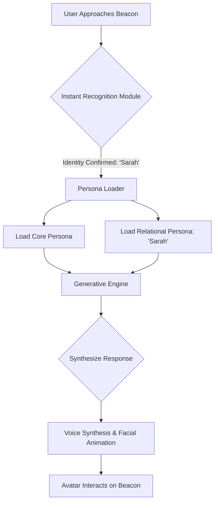

# Xemory: AI Architecture Blueprint

**Author:** Manus AI
**Date:** October 24, 2025

## 1. Overview

This document outlines the technical architecture of the Xemory Artificial Intelligence engine. This is not a traditional, monolithic AI, but a sophisticated, multi-layered system designed to deliver a deeply personal and authentic interactive experience. The architecture is built to support the core mission: to emulate an individual's unique relational dynamics, not just their singular personality. The system is comprised of four primary components: the Core Persona, Relational Personas, the Authenticity Calibration Engine, and the Instant Recognition Module.

## 2. High-Level System Flow

The following diagram illustrates the seamless user interaction flow, from approach to personalized response:

## 3. Core Components

### 3.1. The Core Persona

The **Core Persona** is the foundational AI model of the individual. It represents the baseline of their personality, mannerisms, voice, and general worldview. It is trained on the entirety of the collected data but is generalized to represent the person as they are without the specific context of a one-on-one relationship.

*   **Language Model:** A custom-trained large language model (LLM) that understands the user's vocabulary, sentence structure, humor, and patterns of speech.
*   **Voice Synthesis Model:** A high-fidelity text-to-speech (TTS) model that replicates the user's unique vocal fingerprint, including pitch, cadence, tone, and accent.
*   **Animation Model:** A 3D model of the user's avatar, containing the rules and blendshapes for generating lifelike facial expressions and gestures based on the output of the language model.

### 3.2. The Relational Personas

This is the revolutionary layer of the Xemory architecture. A **Relational Persona** is a smaller, specialized AI model that acts as a *delta* or a *filter* on top of the Core Persona. Each key person in the user's life has their own unique Relational Persona.

*   **Function:** When the system recognizes "Sarah," it loads the "Sarah" Relational Persona. This model modifies the Core Persona's behavior to match the specific dynamic of that relationship. It adjusts:
    *   **Vocabulary:** Using specific nicknames and inside jokes.
    *   **Tone:** Shifting to be more humorous, serious, or affectionate.
    *   **Conflict Style:** Handling disagreements in a way that is authentic to that specific relationship.
*   **Creation:** Each Relational Persona is trained on the specific data collected during the "Relational Calibration" module of the Guided Legacy Session.

### 3.3. The Authenticity Calibration Engine

This engine acts as the master control panel for the AI's disclosure style, translating the user's explicit wishes from the "Digital Will" into actionable rules for the AI.

*   **Input:** It takes the results of the "Disclosure Style Quiz" (e.g., "Unfiltered Authenticity," "Guarded Authenticity") and the user's final consent on any flagged sensitive memories.
*   **Output:** It sets the operational parameters for the Relational Personas. For an "Unfiltered" persona, it will allow the sharing of difficult truths. For a "Guarded" persona, it will instruct the AI to deflect or reframe those same topics. This ensures the avatar's level of candor is perfectly calibrated to the user's choice.

### 3.4. The Instant Recognition Module

This module is the trigger for the entire personalized experience. It uses the camera on the Xemory Beacon to identify the person interacting with it.

*   **Enrollment:** During a one-time setup, family members provide consent and a quick facial scan to create a secure, encrypted facial print.
*   **Real-time Identification:** The module runs a lightweight, efficient facial recognition model locally on the Beacon. Upon identifying a registered user, it passes their ID to the Persona Loader.
*   **Security:** This module also acts as a security gateway, ensuring that private relational dynamics are only accessible to the correct individual.

## 4. Data & Model Lifecycle

The system operates on a two-tier data model:

1.  **Cloud-Based Training:** The massive raw dataset (hundreds of gigabytes of video, audio, etc.) is stored securely in the cloud. This is where the computationally intensive training of the Core and Relational Personas takes place.
2.  **On-Device Inference:** The final, optimized models (a few gigabytes each) are downloaded and stored locally on the Xemory Beacon. All real-time interaction (inference) happens on the device, ensuring privacy and low latency. No conversational data is sent back to the cloud unless explicitly permitted for future model improvements.
